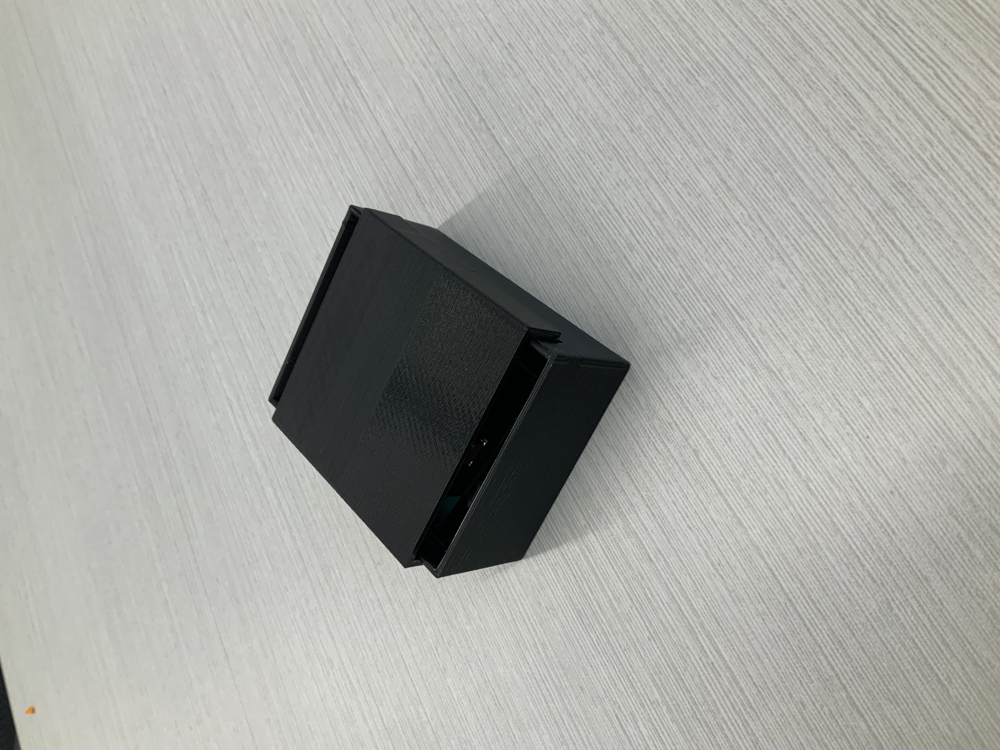
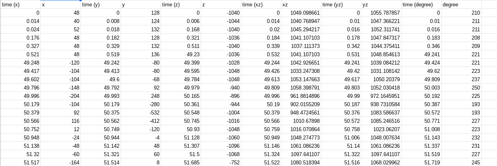
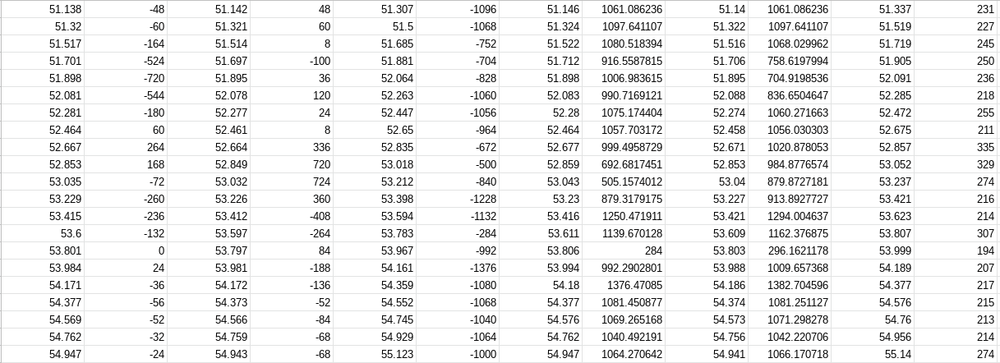
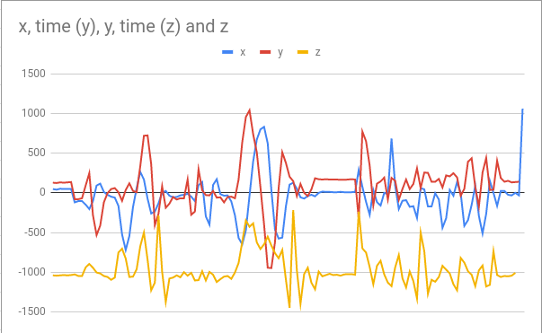
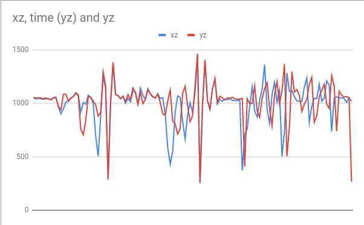
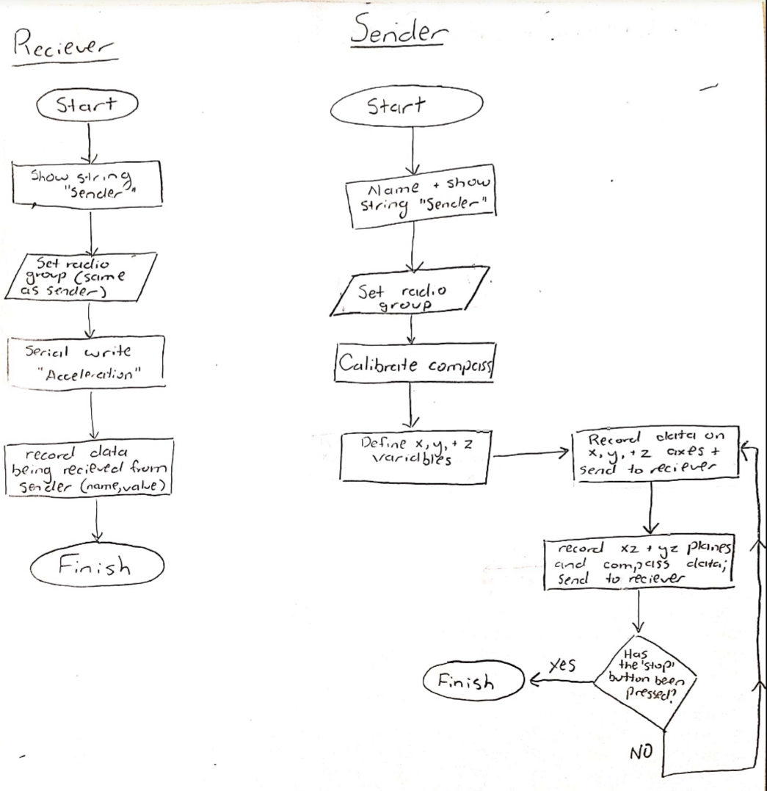
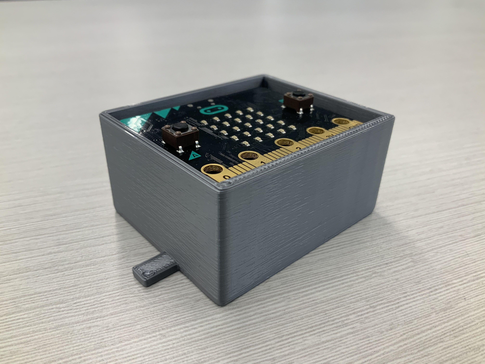
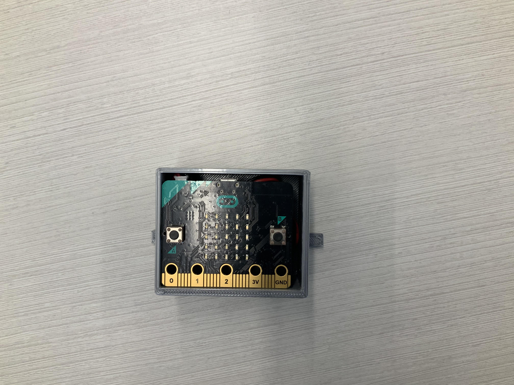
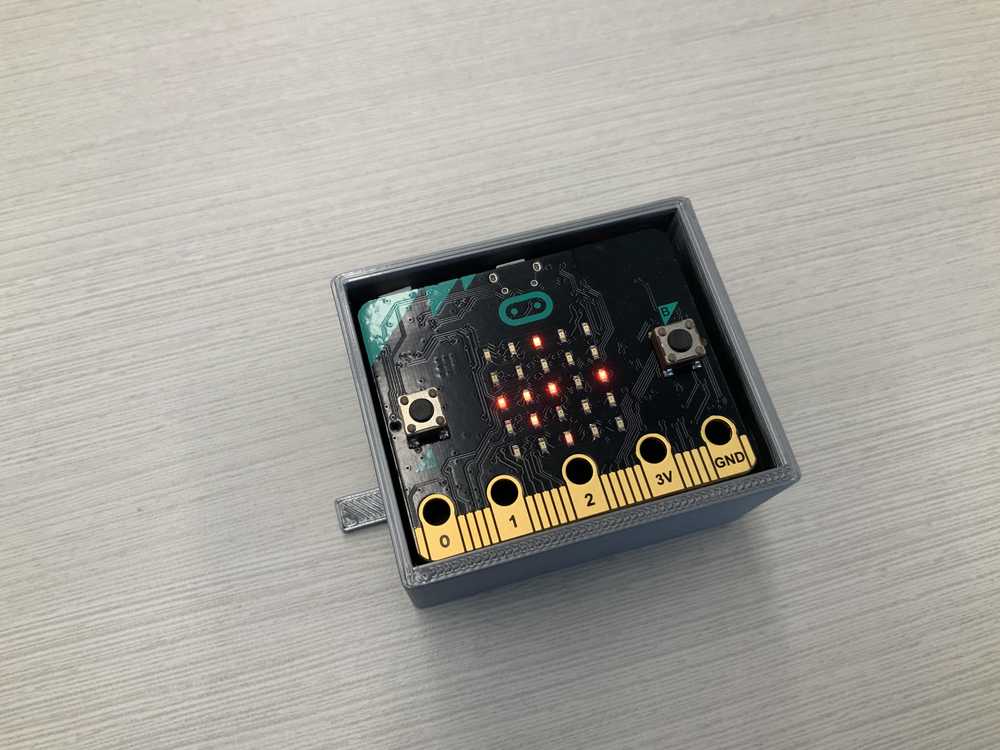

# Mission-to-Mars-Documentation
## Summary of our Solution
Our solution incuded two types of sensors in our payload; one being an acceleration sensor and the other being a compass. The accelerometer records data on the X, Y, and Z axes and the ZX and ZY planes. The compass records the degree from 0-359 in which the micro: Bit is facing relative to the Earth's magnetic feild. One of the micro: Bits streams this data to another that records the data in a computer. The simple enclosure is meant to hold the sender micro: Bit and its battery pack.

## Overview of Process
In order to create the solution, we used the *divide and conquer* group strategy to split the work equally. I worked on the sensor code for the payload while my partner designed the enclosure. Whenever we were able to be together, we both contributed to revisions and troubleshooting in both the code and the enclosure. Once the first enclosure was printed, we talked on the group communication and made notes on various revisions we could make to the prototype. We both made sure to ask plenty of questions and get the other's approval with things we weren't sure of.
* **Insert drawing of initial design**

###### Initial Prototype:

## Team Reflection
Overall, the project was a success, for the solution stayed within the limits weight and size wise, and met the requirements. The code succeeded completely, and everything that we wanted the sensors to record was able to be recorded and displayed on graphs. We probably could have worked faster on the enclosure prototypes to at least get one other prototype in before we made the final product. Otherwise, the solution turned out to be exceptional.
